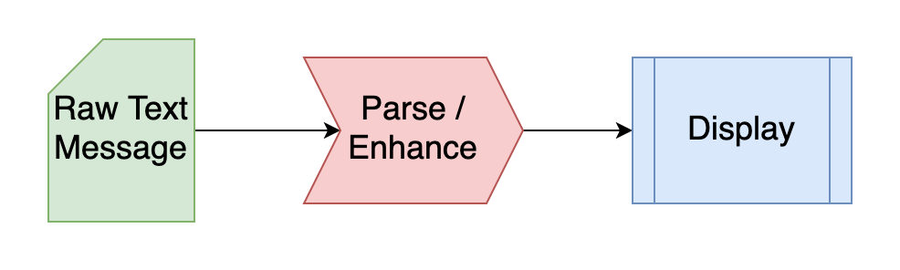
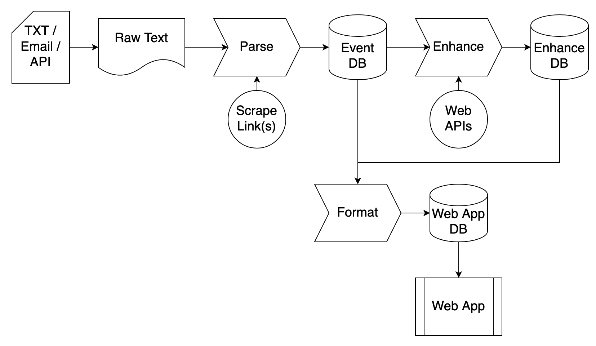

# The-Peoples-Plans

Prod Site: https://master.d2vt7v2anveb09.amplifyapp.com/

## Dev plan

- Terraform setup
  - Open library for functionality
    - Private library for deploying (contains keys)

- Data is stored in s3
  - Json events
  - Encrypted
    - Review base s3 encryption vs kms

- Data apps for processing ingest links / messages
  - Lambda based (python/scala)
  - EC2 + Docker based (python/scala/spark/whatever)

- Lambda to receive and store text/email
  - SES -> SNS -> Lambda -> S3
  - Access restriction by sender

- Amplify for web app
  - Public 
  - Static / SPA (Single page app)
  - HTML/CSS/JS

## Dev Process

1. Create a new **branch** off of current `master` branch
2. Develop and **commit** new changes to new branch
3. Create pull request (**PR**) in Github to **merge** into `master` branch
4. Code review of new PR by other developers for required **approvals**
5. Push a new **plan** in Terraform to deploy changes

## Process Maps

